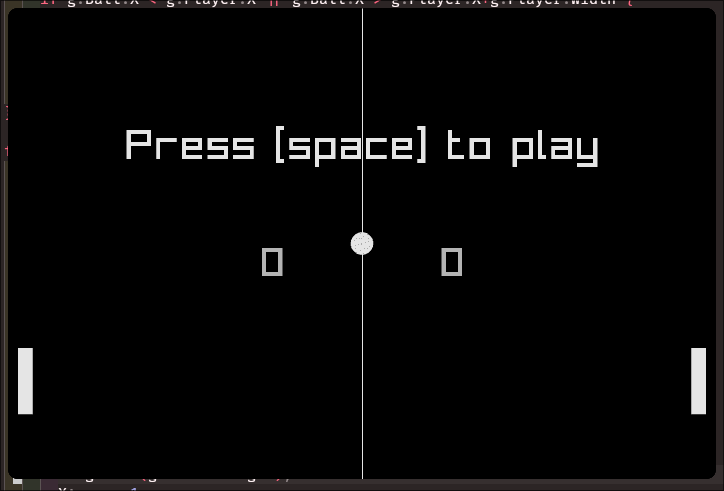

# Pong

A simple pong game made with golang and raylib.

## Screenshots

## Controls

- **M:** Mute
- **R:** Reset
- **Space:** Pause
- **Up/W:** Move player's paddle up
- **Down/S:** Move player's paddle down
- **Escape:** Quit

## Licence

[MIT Licence](./LICENSE)
